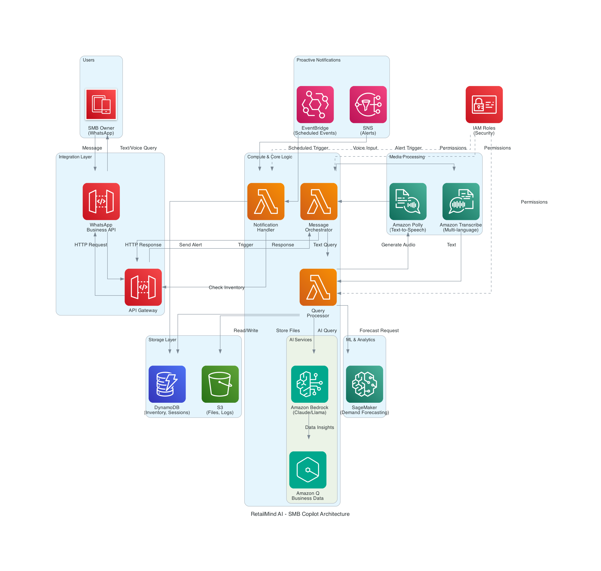
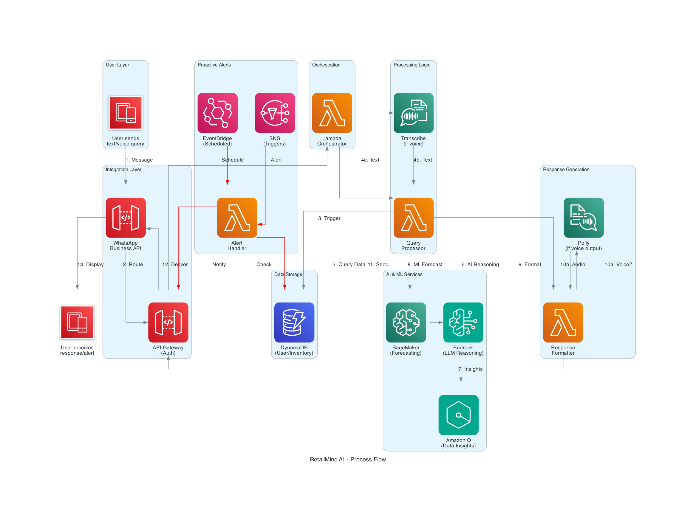
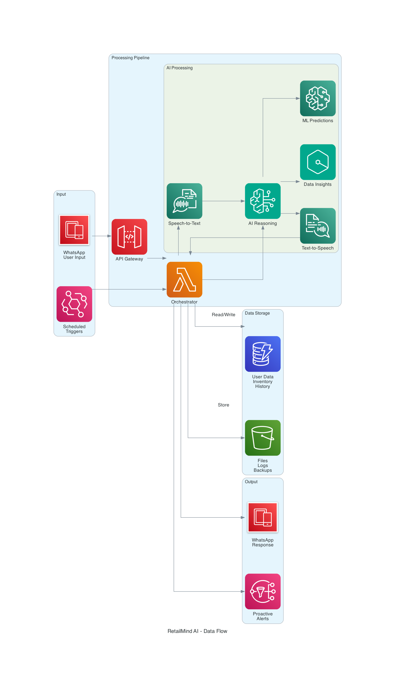
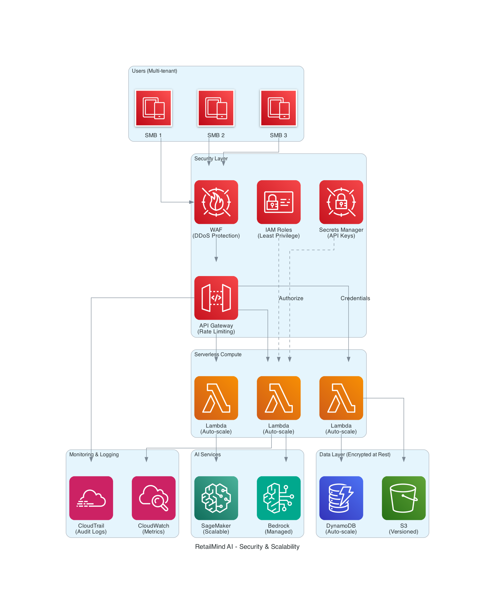

# RetailBrain AI - Design Document

**Version**: 1.0 | **Team**: RetailBrain AI Crew | **Leader**: Arjun

## System Architecture



**Architecture**: Serverless, event-driven, built entirely on AWS services for scalability and cost-efficiency.

**Principles**: Serverless-first (Lambda, API Gateway), Event-driven (EventBridge, SNS), Multi-tenant (data isolation), AI-native (Bedrock, Amazon Q), Mobile-first (WhatsApp).

**Layers**: Presentation (WhatsApp) → Integration (API Gateway) → Application (Lambda functions) → AI/ML (Bedrock, Q, Transcribe, Polly) → Data (DynamoDB, S3) → Infrastructure (IAM, Secrets Manager, CloudWatch)


## Component Design



**WhatsApp Interface**: Primary UI via WhatsApp Business API. Webhook for incoming messages, Cloud API for sending. Supports text, voice, images, interactive buttons, template messages.

**API Gateway**: REST endpoints - POST/GET /webhook (WhatsApp), POST /api/v1/query (internal), GET /health. Features: validation, throttling, API key auth, CloudWatch logging.

**Lambda Functions**:
- `orchestrator` (512MB, 30s): Parse messages, route by intent, manage conversation state
- `processor` (1024MB, 60s): Execute business logic, call Bedrock/Q, handle inventory/forecasting/pricing
- `notifier` (512MB, 5min): Proactive alerts, daily/weekly summaries, EventBridge-triggered
- `voice` (1024MB, 60s): Process voice messages via Transcribe (Hindi/Marathi/English)

**AI/ML**:
- Bedrock: Claude 3 Sonnet (primary), Haiku (fallback) for NLU, intent classification, response generation
- Amazon Q: BI queries on DynamoDB ("top products", "revenue trends")
- Transcribe: Multi-language speech-to-text with custom retail vocabulary
- Polly: Neural voices for text-to-speech responses
- SageMaker: Optional DeepAR/Prophet for advanced forecasting

**Storage**:
- DynamoDB: Users, Inventory, Transactions, Conversations, Forecasts, Alerts (see Data Architecture)
- S3: Voice files (7-day TTL), backups (Glacier after 30d), reports (IA after 30d)

**Events**: EventBridge rules for daily summaries (8 AM), inventory checks (4hr), weekly reports (Mon 9 AM), demand spikes. SNS topics for alerts.


## Data Architecture



**DynamoDB Tables**:

1. **Users** (PK: userId): Profile, business info, language preference, notification settings, subscription
2. **Inventory** (PK: userId, SK: itemId): Item details, stock levels, thresholds, pricing. GSI: userId-category
3. **Transactions** (PK: userId, SK: transactionId): Sales/purchases, amounts, dates. GSI: userId-transactionDate, userId-itemId
4. **Conversations** (PK: userId, SK: messageId): Chat history, intents, responses. TTL: 30 days
5. **Forecasts** (PK: userId, SK: itemId#date): Predictions, confidence, actual vs predicted. TTL: 90 days
6. **Alerts** (PK: userId, SK: alertId): Notifications, severity, acknowledgment status. TTL: 60 days

**Data Flows**:
- Inbound: WhatsApp → API Gateway → Orchestrator → reads Users/Conversations → Processor → queries Inventory/Transactions/Forecasts → Bedrock/Q → saves to Conversations → responds
- Proactive: EventBridge → Notifier → queries Users/Inventory → creates Alerts → Bedrock → WhatsApp

**Backup**: DynamoDB PITR enabled, daily backups to S3 (30d standard, 90d Glacier), cross-region replication for DR.


## API Design

**WhatsApp Webhook**: POST /webhook (receive messages with signature verification), GET /webhook (verification)

**Internal APIs**: POST /api/v1/process-query (query processing), GET/POST /api/v1/inventory/{userId} (inventory management), GET /api/v1/forecast/{userId}/{itemId} (demand forecasts), GET /api/v1/alerts/{userId} (alert retrieval)

**Error Codes**: INVALID_REQUEST, UNAUTHORIZED, USER_NOT_FOUND, ITEM_NOT_FOUND, RATE_LIMIT_EXCEEDED, INTERNAL_ERROR, SERVICE_UNAVAILABLE

All APIs return JSON with standard format: `{success, data/error, timestamp}`


## Security Architecture



**Authentication**: WhatsApp phone-based (no passwords), API key in Secrets Manager, webhook signature verification, IAM roles for services

**Encryption**: At rest (DynamoDB/S3 KMS), in transit (TLS 1.2+), secrets encrypted (Secrets Manager)

**Data Privacy**: Multi-tenant isolation (userId partition key), PII hashed in logs, GDPR-compliant deletion, data in Mumbai region

**Network**: API Gateway rate limiting (100 req/min/user), WAF rules, VPC endpoints for private access, security groups

**Secrets**: Auto-rotation every 90 days for WhatsApp API keys, zero-downtime rotation

**Compliance**: CloudTrail audit logs (90d CloudWatch, 1yr S3), GDPR-ready, SOC 2/ISO 27001 (AWS infrastructure)


## 6. Deployment Architecture

### 6.1 Infrastructure as Code

**AWS CloudFormation / AWS SAM**:
- All infrastructure defined as code
- Separate stacks for different environments
- Nested stacks for modularity

**Stack Structure**:
```
retailmind-main-stack
├── retailmind-network-stack (VPC, subnets, endpoints)
├── retailmind-data-stack (DynamoDB tables, S3 buckets)
├── retailmind-compute-stack (Lambda functions, layers)
├── retailmind-api-stack (API Gateway, authorizers)
├── retailmind-ai-stack (Bedrock configurations, SageMaker)
├── retailmind-monitoring-stack (CloudWatch, alarms)
└── retailmind-security-stack (IAM roles, Secrets Manager)
```

### 6.2 Environment Strategy

**Environments**:

1. **Development** (`dev`)
   - Single region: ap-south-1 (Mumbai)
   - Minimal resources for cost savings
   - DynamoDB on-demand pricing
   - Lambda: 128-512 MB memory
   - No multi-AZ deployments

2. **Staging** (`staging`)
   - Single region: ap-south-1
   - Production-like configuration
   - DynamoDB provisioned capacity (low)
   - Lambda: Production memory settings
   - Used for integration testing

3. **Production** (`prod`)
   - Primary region: ap-south-1 (Mumbai)
   - Backup region: ap-southeast-1 (Singapore) for DR
   - DynamoDB provisioned capacity with auto-scaling
   - Lambda: Optimized memory and concurrency
   - Multi-AZ for critical components

**Environment Variables**:
```
ENVIRONMENT: dev|staging|prod
AWS_REGION: ap-south-1
DYNAMODB_TABLE_PREFIX: retailmind-{env}-
S3_BUCKET_PREFIX: retailmind-{env}-
LOG_LEVEL: DEBUG|INFO|WARN|ERROR
BEDROCK_MODEL_ID: anthropic.claude-3-sonnet-20240229-v1:0
WHATSAPP_API_VERSION: v18.0
```

### 6.3 CI/CD Pipeline

**GitHub Actions Workflow**:

```yaml
name: Deploy RetailMind AI

on:
  push:
    branches: [main, develop]
  pull_request:
    branches: [main]

jobs:
  test:
    runs-on: ubuntu-latest
    steps:
      - uses: actions/checkout@v3
      - name: Run unit tests
        run: pytest tests/unit
      - name: Run integration tests
        run: pytest tests/integration

  deploy-dev:
    needs: test
    if: github.ref == 'refs/heads/develop'
    runs-on: ubuntu-latest
    steps:
      - uses: actions/checkout@v3
      - name: Configure AWS credentials
        uses: aws-actions/configure-aws-credentials@v2
      - name: Deploy to dev
        run: sam deploy --config-env dev

  deploy-prod:
    needs: test
    if: github.ref == 'refs/heads/main'
    runs-on: ubuntu-latest
    steps:
      - uses: actions/checkout@v3
      - name: Configure AWS credentials
        uses: aws-actions/configure-aws-credentials@v2
      - name: Deploy to prod
        run: sam deploy --config-env prod
```

**Deployment Steps**:
1. Code commit to GitHub
2. Automated tests run (unit + integration)
3. Build Lambda deployment packages
4. Package CloudFormation templates
5. Deploy to target environment
6. Run smoke tests
7. Send deployment notification

### 6.4 Lambda Deployment

**Deployment Package**:
- Python code + dependencies in ZIP file
- Lambda layers for common dependencies (boto3, requests)
- Separate layer for AI/ML libraries (if needed)

**Versioning**:
- Lambda versions for each deployment
- Aliases: `dev`, `staging`, `prod`
- Gradual rollout using weighted aliases (10% → 50% → 100%)

**Cold Start Optimization**:
- Provisioned concurrency for critical functions (Orchestrator)
- Lambda SnapStart (if using Java/Python 3.11+)
- Minimal dependencies in deployment package
- Connection pooling for DynamoDB

### 6.5 Database Migration

**DynamoDB Schema Updates**:
- Backward-compatible changes only
- New attributes added without removing old ones
- Migration Lambda for data transformation
- Blue-green deployment for breaking changes

**Migration Process**:
1. Deploy new Lambda version with updated schema
2. Run migration Lambda to update existing records
3. Monitor for errors
4. Switch traffic to new version
5. Deprecate old attributes after grace period

### 6.6 Rollback Strategy

**Automated Rollback Triggers**:
- Error rate >5% for 5 minutes
- Latency >5 seconds (p99) for 5 minutes
- CloudWatch alarm triggers rollback

**Rollback Process**:
1. CloudWatch alarm triggers SNS notification
2. Lambda function updates alias to previous version
3. CloudFormation stack rollback (if infrastructure change)
4. Incident notification to team
5. Post-mortem analysis

### 6.7 Disaster Recovery

**RTO (Recovery Time Objective)**: 4 hours  
**RPO (Recovery Point Objective)**: 1 hour

**DR Strategy**:
- DynamoDB global tables (primary: Mumbai, replica: Singapore)
- S3 cross-region replication
- Lambda functions deployed in both regions
- Route 53 health checks with failover routing

**Failover Process**:
1. Automated health checks detect primary region failure
2. Route 53 switches traffic to secondary region
3. Lambda functions in secondary region activated
4. DynamoDB global tables provide data consistency
5. Manual verification and monitoring


## 7. Technology Stack

### 7.1 Core AWS Services

| Service | Purpose | Configuration |
|---------|---------|---------------|
| **Amazon Bedrock** | AI/ML inference for LLMs | Claude 3 Sonnet, on-demand pricing |
| **Amazon Q** | Business intelligence queries | Custom Q application with DynamoDB connector |
| **AWS Lambda** | Serverless compute | Python 3.11, 512MB-1024MB memory |
| **Amazon API Gateway** | REST API endpoints | Regional API, request validation enabled |
| **Amazon DynamoDB** | NoSQL database | On-demand (dev), provisioned with auto-scaling (prod) |
| **Amazon S3** | Object storage | Standard storage, lifecycle policies enabled |
| **Amazon Transcribe** | Speech-to-text | Multi-language support (hi-IN, mr-IN, en-IN) |
| **Amazon Polly** | Text-to-speech | Neural voices, MP3 output |
| **Amazon SageMaker** | ML model training/inference | Optional for advanced forecasting |
| **Amazon EventBridge** | Event scheduling | Scheduled rules for proactive notifications |
| **Amazon SNS** | Notifications | Topics for alerts and admin notifications |
| **AWS Secrets Manager** | Secrets storage | Automatic rotation enabled |
| **AWS IAM** | Access control | Least privilege policies |
| **Amazon CloudWatch** | Monitoring & logging | Logs, metrics, alarms |
| **AWS CloudTrail** | Audit logging | All API calls logged |
| **AWS SAM** | Infrastructure as Code | CloudFormation-based deployment |

### 7.2 External Services

| Service | Purpose | Integration Method |
|---------|---------|-------------------|
| **WhatsApp Business API** | Primary user interface | Cloud API via HTTPS webhooks |
| **Google Sheets API** | Optional data import | OAuth 2.0, read-only access |
| **Payment Gateway** | Subscription payments | Razorpay/Stripe webhook integration |

### 7.3 Development Tools

| Tool | Purpose |
|------|---------|
| **Python 3.11** | Primary programming language |
| **boto3** | AWS SDK for Python |
| **pytest** | Unit and integration testing |
| **black** | Code formatting |
| **pylint** | Code linting |
| **mypy** | Static type checking |
| **GitHub Actions** | CI/CD pipeline |
| **AWS SAM CLI** | Local testing and deployment |
| **Postman** | API testing |
| **LocalStack** | Local AWS service emulation |

### 7.4 Python Dependencies

**Core Dependencies** (`requirements.txt`):
```
boto3==1.34.0
botocore==1.34.0
requests==2.31.0
python-dateutil==2.8.2
pydantic==2.5.0
```

**AI/ML Dependencies**:
```
anthropic==0.8.0  # Bedrock SDK
langchain==0.1.0  # LLM orchestration (optional)
pandas==2.1.0  # Data analysis
numpy==1.26.0  # Numerical computing
```

**Testing Dependencies** (`requirements-dev.txt`):
```
pytest==7.4.0
pytest-cov==4.1.0
pytest-mock==3.12.0
moto==4.2.0  # AWS service mocking
black==23.12.0
pylint==3.0.0
mypy==1.7.0
```

### 7.5 Lambda Layers

**Layer 1: Common Dependencies** (`retailmind-common-layer`)
- boto3, botocore, requests
- python-dateutil, pydantic
- Size: ~15 MB
- Compatible runtimes: Python 3.11

**Layer 2: AI/ML Dependencies** (`retailmind-ai-layer`)
- anthropic, langchain
- pandas, numpy
- Size: ~50 MB
- Compatible runtimes: Python 3.11

**Benefits**:
- Reduce deployment package size
- Faster deployments
- Shared dependencies across functions
- Easier dependency management

### 7.6 Architecture Diagrams

**Generated Diagrams** (see `generated-diagrams/` folder):

1. **retailmind-ai-architecture.png.png**
   - Complete system architecture
   - All AWS services and integrations
   - Data flow between components

2. **retailmind-process-flow.png.png**
   - Step-by-step workflow
   - User interaction to response generation
   - Numbered process steps

3. **retailmind-data-flow.png.png**
   - Data flow from input to output
   - Database read/write operations
   - AI/ML processing pipeline

4. **retailmind-features.png.png**
   - Core features overview
   - Feature-to-service mapping
   - User-facing capabilities

5. **retailmind-security-scalability.png.png**
   - Security architecture
   - Scalability patterns
   - High availability design

6. **retailmind-use-cases.png.png**
   - Common use case flows
   - User journey mapping
   - Feature interactions


## 8. Integration Patterns

### 8.1 WhatsApp Business API Integration

**Message Reception Flow**:
```
WhatsApp User → WhatsApp Cloud API → Webhook (API Gateway) 
→ Orchestrator Lambda → Process & Respond
```

**Message Sending Flow**:
```
Lambda Function → WhatsApp Cloud API → WhatsApp User
```

**Implementation Details**:
- Webhook URL: `https://api.retailmind.ai/webhook`
- Verification token stored in Secrets Manager
- Message signature validation for security
- Retry logic with exponential backoff
- Message queue for high volume (SQS optional)

**Supported Message Types**:
- Text messages (primary)
- Audio messages (voice notes)
- Image messages (future: product photos)
- Interactive buttons (future: quick replies)
- Template messages (for proactive notifications)

### 8.2 Amazon Bedrock Integration

**Invocation Pattern**:
```python
import boto3
import json

bedrock = boto3.client('bedrock-runtime', region_name='ap-south-1')

def invoke_bedrock(prompt, system_prompt, max_tokens=2048):
    body = json.dumps({
        "anthropic_version": "bedrock-2023-05-31",
        "max_tokens": max_tokens,
        "system": system_prompt,
        "messages": [
            {"role": "user", "content": prompt}
        ],
        "temperature": 0.7
    })
    
    response = bedrock.invoke_model(
        modelId='anthropic.claude-3-sonnet-20240229-v1:0',
        body=body
    )
    
    response_body = json.loads(response['body'].read())
    return response_body['content'][0]['text']
```

**System Prompts**:
- **Inventory Assistant**: "You are an AI assistant for a small business owner in India. Help them manage inventory, answer questions about stock levels, and provide recommendations. Respond in {language}."
- **Forecasting Assistant**: "You are a demand forecasting expert. Analyze sales data and provide predictions with confidence levels. Explain your reasoning simply."
- **Pricing Assistant**: "You are a pricing strategist. Suggest optimal prices based on demand, competition, and inventory levels. Focus on profitability."

**Error Handling**:
- Throttling: Retry with exponential backoff
- Model errors: Fallback to simpler model (Haiku)
- Timeout: Return cached response or generic message

### 8.3 Amazon Q Integration

**Setup**:
1. Create Amazon Q application
2. Configure DynamoDB as data source
3. Define schema mapping for business queries
4. Set up IAM permissions

**Query Pattern**:
```python
import boto3

q_client = boto3.client('qbusiness', region_name='ap-south-1')

def query_amazon_q(user_id, question):
    response = q_client.chat_sync(
        applicationId='retailmind-q-app',
        userId=user_id,
        userMessage=question,
        conversationId=None  # New conversation
    )
    
    return response['systemMessage']
```

**Example Queries**:
- "What are my top 5 selling products this month?"
- "Show me items with less than 10 units in stock"
- "What's my total revenue for last week?"

### 8.4 DynamoDB Access Patterns

**Pattern 1: Get User Profile**
```python
response = dynamodb.get_item(
    TableName='retailmind-users',
    Key={'userId': {'S': user_id}}
)
```

**Pattern 2: Query User Inventory**
```python
response = dynamodb.query(
    TableName='retailmind-inventory',
    KeyConditionExpression='userId = :uid',
    ExpressionAttributeValues={':uid': {'S': user_id}}
)
```

**Pattern 3: Query Transactions by Date Range**
```python
response = dynamodb.query(
    TableName='retailmind-transactions',
    IndexName='userId-transactionDate-index',
    KeyConditionExpression='userId = :uid AND transactionDate BETWEEN :start AND :end',
    ExpressionAttributeValues={
        ':uid': {'S': user_id},
        ':start': {'S': '2026-02-01'},
        ':end': {'S': '2026-02-28'}
    }
)
```

**Pattern 4: Batch Write for Bulk Updates**
```python
with table.batch_writer() as batch:
    for item in items:
        batch.put_item(Item=item)
```

### 8.5 Event-Driven Architecture

**EventBridge Rules**:

**Rule 1: Daily Summary**
```json
{
  "schedule": "cron(0 8 * * ? *)",
  "target": {
    "arn": "arn:aws:lambda:ap-south-1:123456789012:function:retailmind-notifier",
    "input": {
      "notificationType": "daily_summary"
    }
  }
}
```

**Rule 2: Inventory Check**
```json
{
  "schedule": "rate(4 hours)",
  "target": {
    "arn": "arn:aws:lambda:ap-south-1:123456789012:function:retailmind-notifier",
    "input": {
      "notificationType": "inventory_check"
    }
  }
}
```

**Rule 3: Demand Spike Detection**
```json
{
  "source": ["retailmind.transactions"],
  "detail-type": ["Transaction Created"],
  "detail": {
    "transactionType": ["sale"],
    "quantity": [{"numeric": [">", 10]}]
  },
  "target": {
    "arn": "arn:aws:lambda:ap-south-1:123456789012:function:retailmind-notifier",
    "input": {
      "notificationType": "demand_spike"
    }
  }
}
```

### 8.6 Caching Strategy

**Use Cases for Caching**:
- User profiles (frequently accessed)
- Inventory data (reduce DynamoDB reads)
- Forecast results (expensive to compute)
- Bedrock responses for common queries

**Implementation Options**:

**Option 1: Lambda Environment Variables** (for static data)
```python
import os
COMMON_RESPONSES = json.loads(os.environ['COMMON_RESPONSES'])
```

**Option 2: DynamoDB TTL** (for temporary data)
- Store cache in DynamoDB with TTL attribute
- Automatic expiration after specified time

**Option 3: ElastiCache Redis** (for high-performance caching)
- Separate Redis cluster for caching
- Lambda functions connect via VPC
- Cache invalidation on data updates

**Cache Invalidation**:
- Time-based: TTL of 5-15 minutes
- Event-based: Invalidate on inventory updates
- Manual: Admin API to clear cache

