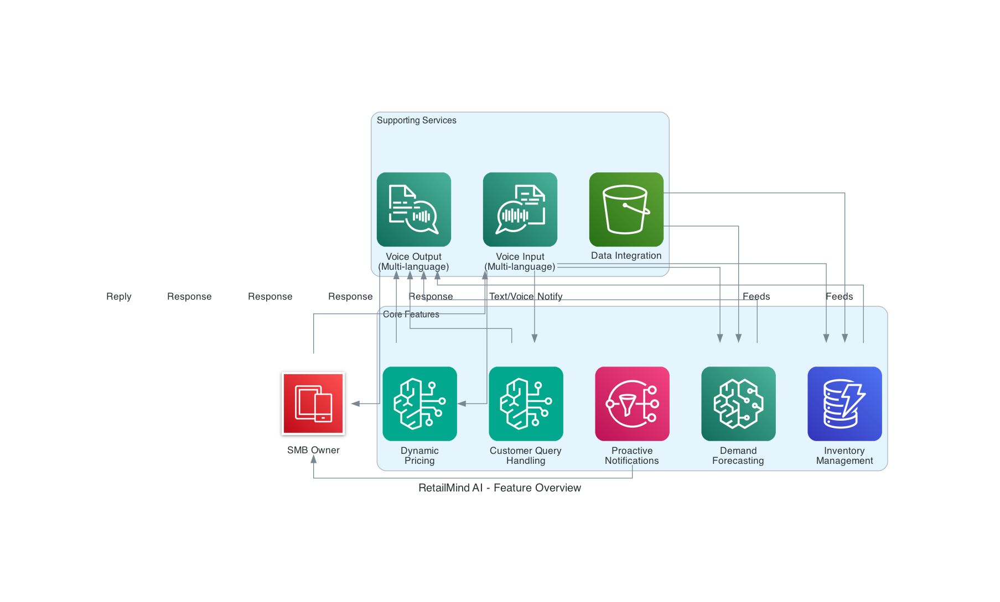
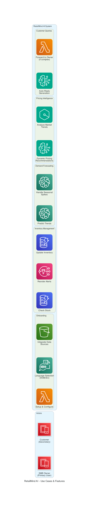

# RetailBrain AI - Requirements Document

## Project Overview

**Team Name:** RetailBrain AI Crew  
**Team Leader:** Arjun  
**Problem Statement:** AI for Retail, Commerce & Market Intelligence  
**Target Audience:** Small & Medium Businesses (SMBs) across India

## Executive Summary

RetailBrain AI is an AI-powered WhatsApp assistant that transforms small businesses into smarter, more profitable operations. Voice/text-based AI assistance in Hindi, Marathi, and English for inventory management, demand forecasting, dynamic pricing, customer service, and proactive insights.

## Problem Statement

SMB owners spend 4-6 hours daily on routine tasks without access to affordable business intelligence. Existing solutions are either too complex (SAP, Zoho) or lack AI capabilities (Khatabook). Most don't support regional languages or provide proactive insights.

**Target Market**: Retail shops, online sellers, marketplace vendors (Meesho/Flipkart), D2C brands in tier-2/3 cities. Initial focus: Pune. Scale potential: Millions of SMBs across India.

## Solution Overview

WhatsApp + Voice AI that turns any small business into a smarter, more profitable operation — no tech skills or big budget required.

**Value Proposition**: Accessible (WhatsApp, multi-language voice), Intelligent (AI-powered insights), Proactive (alerts before problems occur), Simple (zero-infrastructure setup), Affordable (AWS serverless).

**Expected Impact**: Save 4-6 hours/day, boost revenue 20-30%, empower non-tech owners.

## Functional Requirements

### FR1: Multi-Language Voice & Text Interface

**Priority**: High  
**Description**: Support natural language interaction via WhatsApp

**Requirements**:
- FR1.1: Accept text messages in Hindi, Marathi, and English
- FR1.2: Accept voice notes and convert to text using Amazon Transcribe
- FR1.3: Respond with text messages
- FR1.4: Generate voice responses using Amazon Polly when requested
- FR1.5: Auto-detect language from user input
- FR1.6: Support language switching mid-conversation

**Acceptance Criteria**:
- Voice recognition accuracy >90% for supported languages
- Response time <3 seconds for text queries
- Response time <5 seconds for voice queries

### FR2: Real-Time Inventory Management

**Priority**: High  
**Description**: Track inventory levels and provide smart reorder alerts

**Requirements**:
- FR2.1: Query current stock levels by item name or category
- FR2.2: Update inventory via voice/text commands
- FR2.3: Set minimum stock thresholds per item
- FR2.4: Generate automatic reorder alerts when stock falls below threshold
- FR2.5: Track inventory history and movement patterns
- FR2.6: Support bulk inventory updates via file upload

**Acceptance Criteria**:
- Real-time inventory updates within 1 second
- Accurate stock level reporting 99.9% of the time
- Proactive alerts sent within 5 minutes of threshold breach

### FR3: Demand Forecasting

**Priority**: High  
**Description**: Predict future demand based on historical data and trends

**Requirements**:
- FR3.1: Analyze daily, weekly, and monthly sales trends
- FR3.2: Identify seasonal patterns and spikes
- FR3.3: Predict demand for next 7, 14, and 30 days
- FR3.4: Factor in festivals, holidays, and local events
- FR3.5: Provide confidence levels for predictions
- FR3.6: Adjust forecasts based on new data

**Acceptance Criteria**:
- Forecast accuracy >75% for 7-day predictions
- Identify seasonal spikes with >80% accuracy
- Update forecasts daily with new sales data

### FR4: Dynamic Pricing Intelligence

**Priority**: Medium  
**Description**: Suggest optimal pricing based on market trends and demand

**Requirements**:
- FR4.1: Analyze competitor pricing (when available)
- FR4.2: Consider demand trends and inventory levels
- FR4.3: Suggest price increases during high demand
- FR4.4: Recommend discounts for slow-moving inventory
- FR4.5: Calculate profit margins for suggested prices
- FR4.6: Provide reasoning for each pricing suggestion

**Acceptance Criteria**:
- Pricing suggestions improve profit margins by 10-15%
- Recommendations consider both revenue and inventory turnover
- Clear explanations provided for all suggestions

### FR5: Customer Query Auto-Response

**Priority**: Medium  
**Description**: Automatically handle common customer queries via WhatsApp

**Requirements**:
- FR5.1: Detect customer queries forwarded by business owner
- FR5.2: Generate contextual responses based on business data
- FR5.3: Answer product availability questions
- FR5.4: Provide pricing information
- FR5.5: Handle order status inquiries
- FR5.6: Escalate complex queries to owner with context

**Acceptance Criteria**:
- Auto-resolve 70% of common queries
- Response accuracy >85%
- Escalation with full context for complex queries

### FR6: Proactive Notifications & Alerts

**Priority**: High  
**Description**: Send timely alerts and insights without user prompting

**Requirements**:
- FR6.1: Daily business summary (sales, inventory status)
- FR6.2: Low stock alerts with reorder suggestions
- FR6.3: Demand spike notifications
- FR6.4: Pricing opportunity alerts
- FR6.5: Weekly performance reports
- FR6.6: Customizable notification preferences

**Acceptance Criteria**:
- Alerts sent within 5 minutes of trigger event
- Daily summaries delivered at user-specified time
- <5% false positive rate for alerts

### FR7: Market Trend Summaries

**Priority**: Low  
**Description**: Provide quick insights on market trends and opportunities

**Requirements**:
- FR7.1: Summarize relevant market trends for business category
- FR7.2: Identify emerging product opportunities
- FR7.3: Highlight competitor activities (when available)
- FR7.4: Provide seasonal trend predictions
- FR7.5: Deliver weekly market intelligence reports

**Acceptance Criteria**:
- Relevant trends identified for user's business category
- Actionable insights provided in simple language
- Weekly reports delivered consistently

### FR8: Onboarding & Setup

**Priority**: High  
**Description**: Simple, guided setup process via WhatsApp

**Requirements**:
- FR8.1: QR code or phone number-based bot addition
- FR8.2: Welcome message with language selection
- FR8.3: Guided business profile setup
- FR8.4: Data source integration (Google Sheets, manual entry)
- FR8.5: Initial inventory import
- FR8.6: Preference configuration (notification times, alert thresholds)

**Acceptance Criteria**:
- Complete onboarding in <10 minutes
- Support for non-technical users
- Clear instructions in user's preferred language

## Non-Functional Requirements

**Performance**: <3s response time (95%), <5s voice processing, 1,000+ concurrent users, 99.5% uptime

**Scalability**: Scale 100→10,000 users without architecture changes, handle 1M+ transactions/month, auto-scaling enabled

**Security**: Encryption at rest/transit, IAM least privilege, GDPR-ready, multi-tenant data isolation

**Reliability**: Daily backups, RPO <1hr, RTO <4hrs, graceful error handling, CloudTrail audit logs

**Usability**: Multi-language (Hindi/Marathi/English), voice interface, <30min learning curve, works on any smartphone

**Cost**: MVP ₹0-5K (Free Tier), scaled ₹15-30K/month (1,000 users), subscription ₹99-499/user/month

## Technical Requirements

**AWS Services**: Bedrock (LLMs), Amazon Q (BI), Lambda (compute), API Gateway, Transcribe/Polly (voice), DynamoDB (data), S3 (storage), SageMaker (ML), EventBridge (scheduling), SNS (notifications), IAM, Secrets Manager, CloudWatch, CloudTrail

**External Integrations**: WhatsApp Business API, Google Sheets API (optional), Payment gateway

**Data Models**: Users (profile, preferences, subscription), Inventory (items, stock, thresholds), Transactions (sales/purchases), Forecasts (predictions, confidence), Alerts (notifications, status)

**Key APIs**: POST/GET /webhook (WhatsApp), POST /process-query, GET/POST /inventory/{userId}, GET /forecast/{userId}/{itemId}

## User Stories

**Inventory Management**: Check stock ("How many shirts?"), receive low stock alerts, update via voice ("Sold 5 shirts today")

**Demand Forecasting**: Get 7/14/30-day predictions, receive seasonal spike notifications

**Pricing Intelligence**: Get pricing suggestions based on demand, discount recommendations for slow-moving items

**Customer Service**: Auto-reply to availability queries, escalate complex queries with context

**Proactive Insights**: Daily business summaries, demand spike alerts, weekly performance reports

## Success Metrics

### Business Metrics

- **User Adoption**: 1,000 active users within 6 months
- **User Retention**: >70% monthly active users
- **Time Saved**: Average 4-6 hours/day per user
- **Revenue Impact**: 20-30% increase in user revenue
- **Customer Satisfaction**: NPS score >50

### Technical Metrics

- **Response Time**: <3 seconds (95th percentile)
- **Uptime**: >99.5%
- **Error Rate**: <1% of requests
- **Voice Accuracy**: >90% transcription accuracy
- **Forecast Accuracy**: >75% for 7-day predictions

### Cost Metrics

- **Cost per User**: <₹30/month at scale
- **Infrastructure Cost**: <30% of revenue
- **AWS Optimization**: Maintain Free Tier usage for MVP

## Constraints & Assumptions

### Constraints

1. **WhatsApp Dependency**: Relies on WhatsApp Business API availability
2. **Language Support**: Initial launch limited to Hindi, Marathi, English
3. **Data Requirements**: Requires historical data for accurate forecasting
4. **Internet Connectivity**: Requires stable internet connection
5. **Budget**: MVP must work within AWS Free Tier limits

### Assumptions

1. Target users have smartphones with WhatsApp
2. Users are willing to share business data for AI insights
3. WhatsApp Business API remains accessible and affordable
4. AWS services maintain current pricing and availability
5. Users can provide initial inventory data for setup

## Risks & Mitigation

| Risk | Impact | Probability | Mitigation |
|------|--------|-------------|------------|
| WhatsApp API changes | High | Medium | Build abstraction layer, monitor API updates |
| Low forecast accuracy | Medium | Medium | Continuous ML model improvement, user feedback loop |
| User adoption challenges | High | Medium | Focus on UX, provide onboarding support, local language marketing |
| AWS cost overruns | Medium | Low | Implement cost monitoring, optimize Lambda functions, use reserved capacity |
| Data privacy concerns | High | Low | Transparent privacy policy, encryption, compliance certifications |
| Competition from established players | Medium | High | Focus on SMB-specific features, affordability, local language support |

## Future Enhancements (Post-MVP)

1. **Additional Languages**: Tamil, Telugu, Bengali, Gujarati
2. **Advanced Analytics**: Profit margin analysis, customer segmentation
3. **Multi-Channel Support**: SMS, Telegram, web dashboard
4. **Marketplace Integration**: Direct integration with Flipkart, Meesho, Amazon
5. **Financial Services**: Invoice generation, payment tracking, GST compliance
6. **Team Collaboration**: Multi-user access, role-based permissions
7. **Supplier Management**: Automated purchase orders, supplier recommendations
8. **Marketing Automation**: Campaign suggestions, customer retention strategies

## Appendix

### Glossary

- **SMB**: Small and Medium Business
- **LLM**: Large Language Model
- **NPS**: Net Promoter Score
- **RPO**: Recovery Point Objective
- **RTO**: Recovery Time Objective
- **SKU**: Stock Keeping Unit

### References

- AWS Well-Architected Framework
- WhatsApp Business API Documentation
- Amazon Bedrock Documentation
- Amazon Q Documentation
